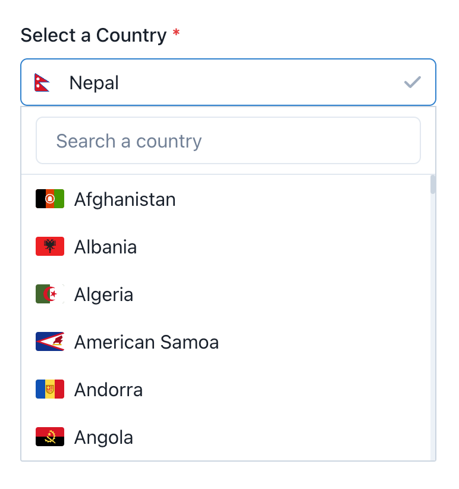

# React Chakra Country Selector



This repository is a port of the [Country Picker](https://github.com/driaug/country-picker) component.

## Requirements

- [Chakra UI](https://chakra-ui.com/)

## Usage

After installing the dependencies. Copy the selector, countries and types to your own project from `src/lib` and `src/components`.

```tsx
import { useState } from "react";
import { SelectMenuOption } from "@/lib/types";
import { COUNTRIES } from "@/lib/countries";
import CountrySelector from "@/components/CountrySelector";

const myPage = () => {
  const [isOpen, setIsOpen] = useState(false);
  const [country, setCountry] = useState<SelectMenuOption>({
    title: "Nepal",
    value: "NP",
  });

  return (
   <CountrySelector
      id="country-selector"
      open={isOpen}
      onToggle={() => setIsOpen(!isOpen)}
      onChange={(country) => {
      setCountry(country);
      }}
      selectedValue={
      COUNTRIES.find(
         (option) => option.value === country.value
      ) as SelectMenuOption
      }
   />
  );
}
```

## Author

👤 **Pawan Paudel**

- Github: [@pawanpaudel93](https://github.com/pawanpaudel93)

## 🤝 Contributing

Contributions, issues and feature requests are welcome! \ Feel free to check [issues page](https://github.com/pawanpaudel93/chakra-country-picker/issues).

## Show your support

Give a ⭐️ if this project helped you!

## Credits

This repository is a port of the [Country Picker](https://github.com/driaug/country-picker) repository by [Dries Augustyns](https://github.com/driaug).
